# Faculty Management System

A desktop application built with Java Swing for managing 
students, courses, and faculty records.

## Technologies Used
- Java Swing
- MySQL
- MVC Architecture

## Features
- Manage 200+ students and 30+ courses
- Full CRUD operations
- MVC architecture separating models, views, and controllers
- MySQL database integration

## How to Run
1. Clone the repository
2. Import the project into your IDE (IntelliJ or Eclipse)
3. Configure MySQL database connection in the config file
4. Run Main.java

## Screenshots

### Login
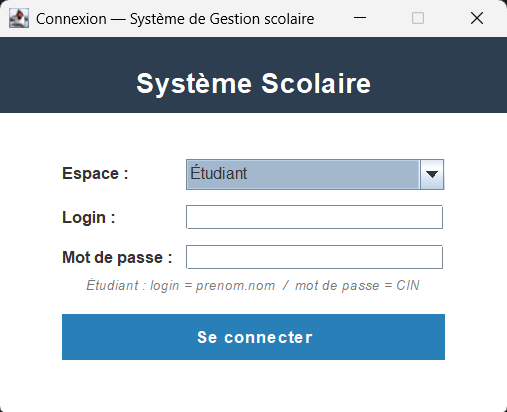

### Admin
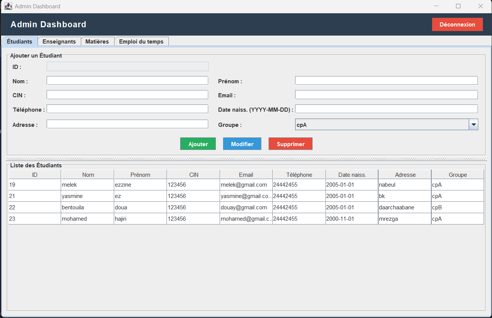
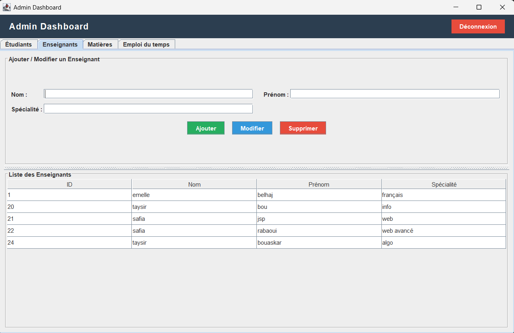
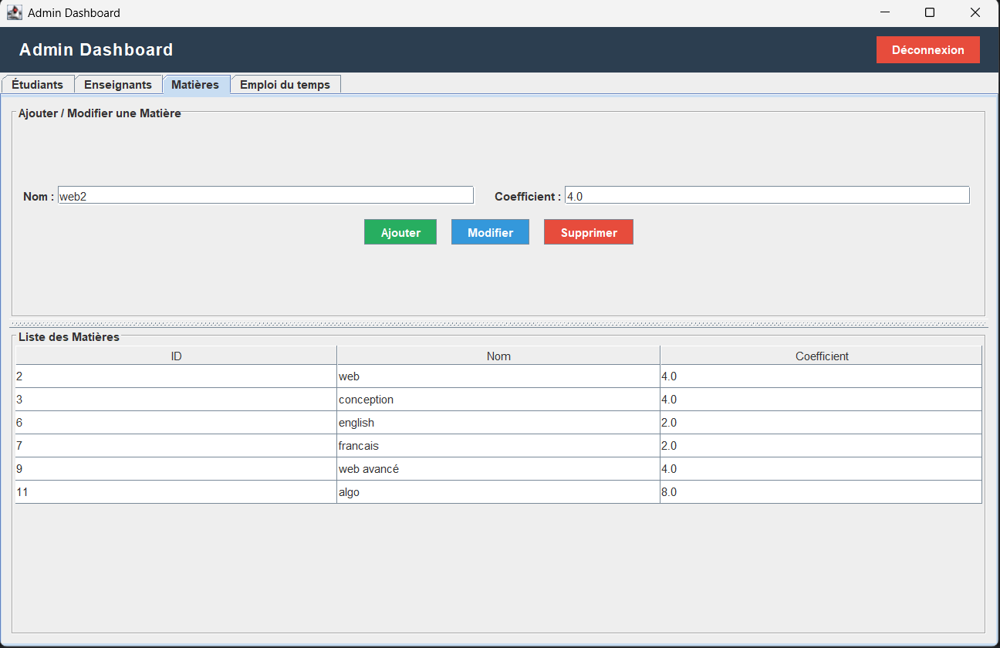
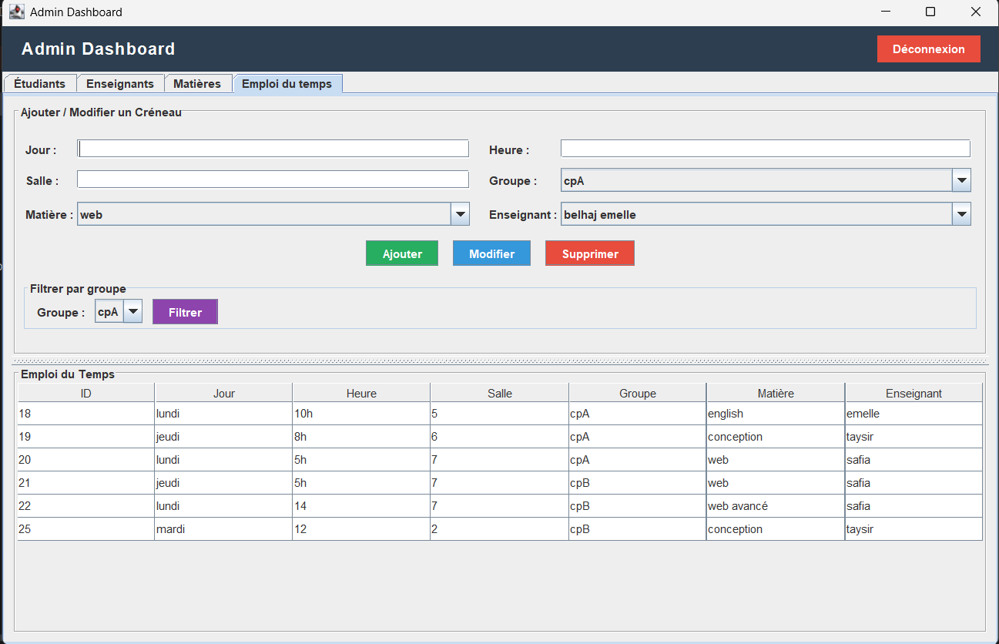

### Student
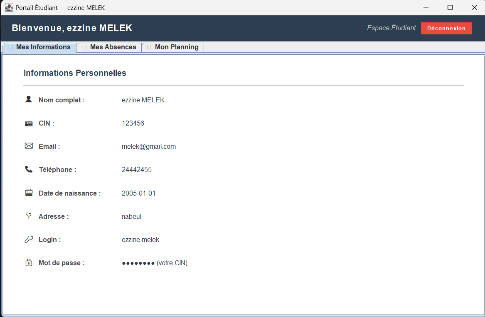
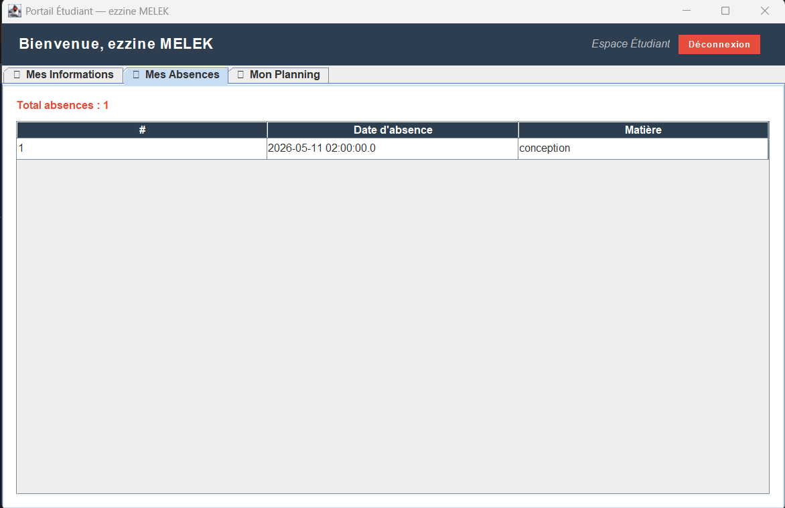
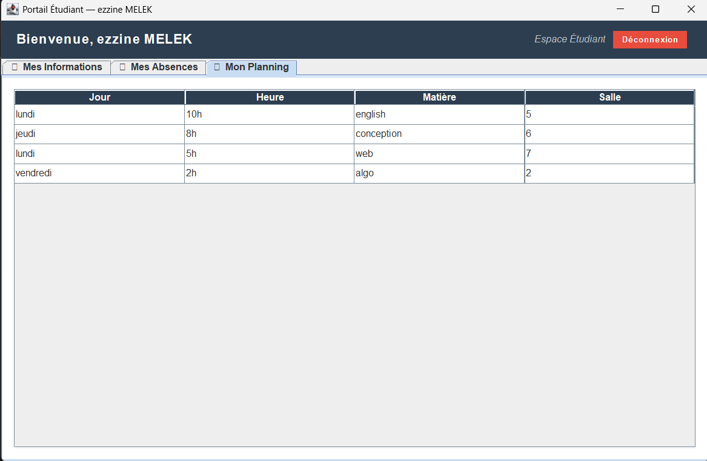

### Professor
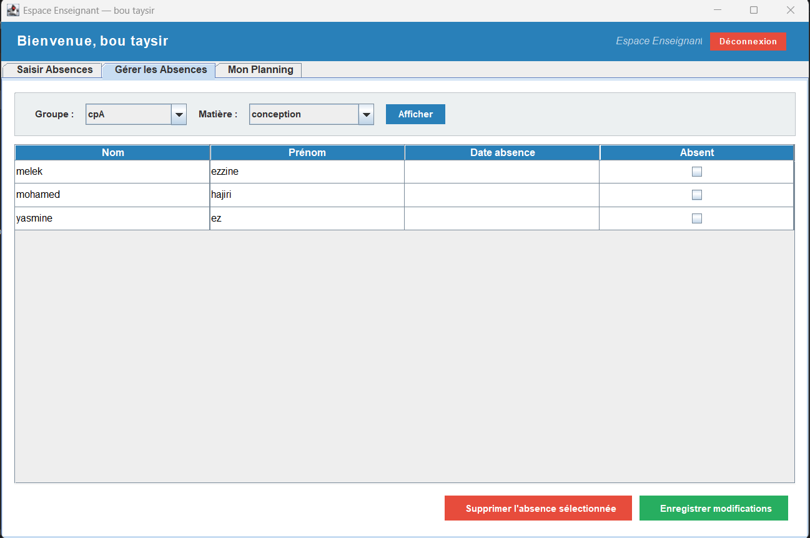
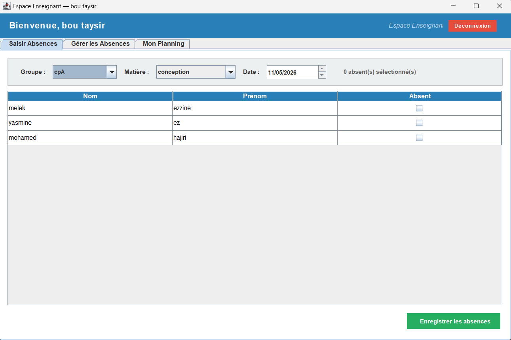
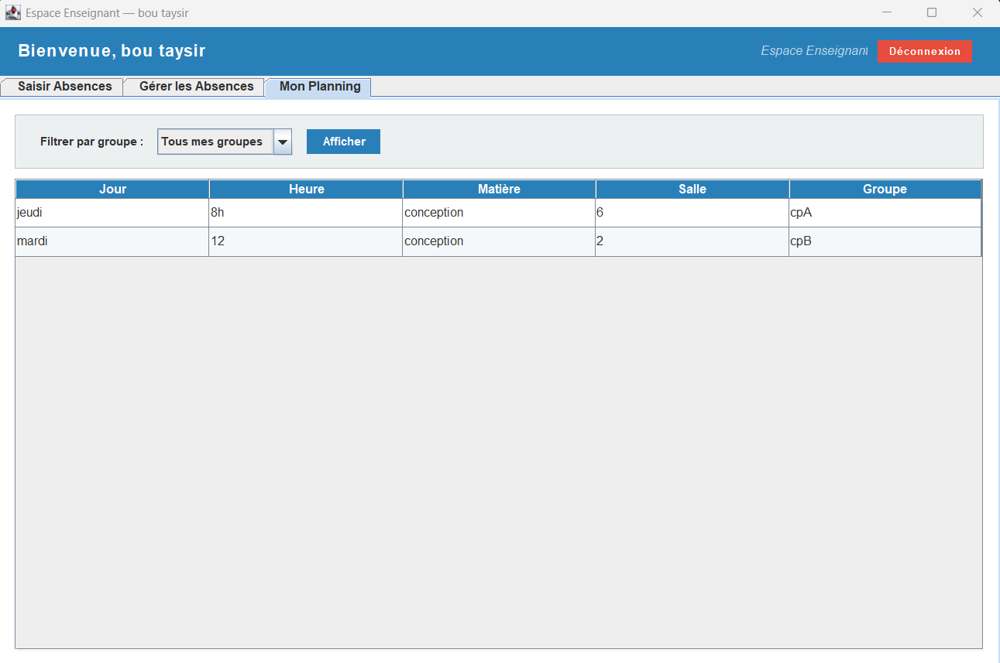
